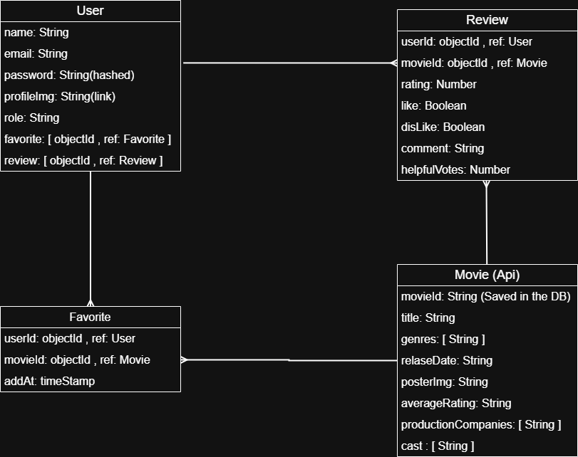
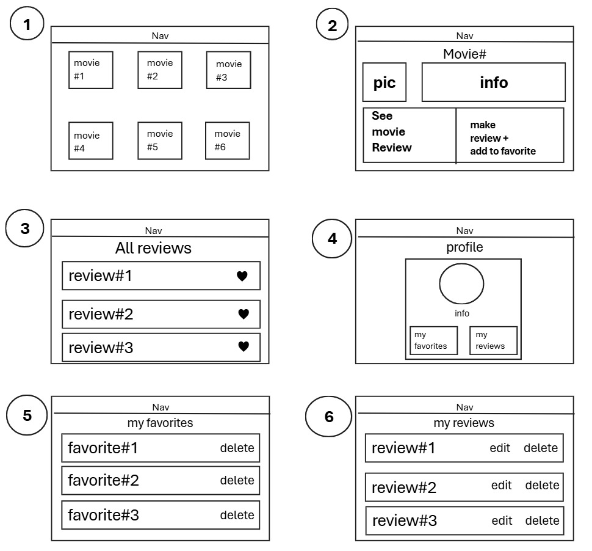
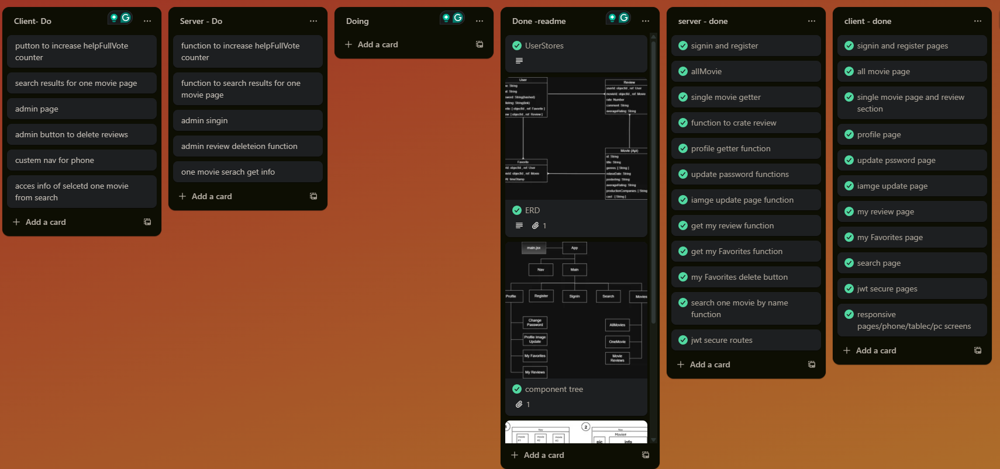

 

# MovieReview

full-stack web application built with the MERN stack (MongoDB, Express.js, React.js, Node.js). It enables users to securely register, authenticate, and explore movie reviews powered by the TMDB API. The app features responsive, mobile-first design with animated transitions for an immersive user experience. Users can browse popular films, post and manage personal reviews, and access user-specific features protected by JWT-based authentication. MongoDB handles CRUD operations for users and reviews, ensuring fast and scalable performance across devices.

## Deployed link:

[link ]()  still not done

 

## Planning Materials:

### ERD:

### WireFrame:

### UserStory:

- As a user, I want to register and log in securely so that I can access personalized features and protect my data.

- As a user, I want to browse trending and popular movies so I can discover films worth watching.

- As a user, I want to write, update, and delete my own reviews so I can express my opinions about movies.

- As a user, I want to read reviews from other users to help me decide what to watch next.

- As a user, I want to access my personal dashboard to manage my reviews and track my activity.

- As a user, I want to navigate the application easily on any device so I can enjoy a seamless experience from mobile to desktop.

- As a user, I want to interact with a smooth, animated interface to make using the app feel intuitive and enjoyable.

- As a user, I want to ensure my personal content and routes are protected using authentication so that only I can access my reviews.

### Component Hierarchy Diagrams:

### trello: [Link](https://trello.com/invite/b/685a959004e84b6ef9cf1d49/ATTId7eff43675f6c15d5af39faef3c0dace787FFC1A/moviereview)

## ScreenShots:

 
 

 
 

 
 

## Recording:

 
 

## How to run locally:

1. This Repo:

   - Clone the repository.
   - Install dependencies: `npm i`
   - at `/src/service/api.js`
     - change `BASE_URL` to `BASE_URL = "http://localhost:3000"`
   - Start the client: `npm run dev`

2. Server Repo: [link](https://github.com/HusainNit/movieReview-server)
   - Clone the repository.
   - Install dependencies: `npm i`
   - create `.env` file
     - add `MONGODB_URI`
     - add `SALT_ROUNDS`
     - add `APP_SECRET`
     - optional, add `PORT` which in define you need to change client port. default port in server and client is `3000`
   - Start the server: `npm start`

Open the application in your browser at `http://localhost:5173`

## Technologies Used:

- MERN Stack:
  - MongoDB
  - Express.js
  - React.js
  - Node.js

 

- client:

  - HTML
  - CSS
  - JavaScript
  - vite
  - axios
  - react router dom

- server:
  - MongoDB
  - Mongoose
  - Express
  - Axios
  - cors
  - bcrypt
  - jsonwebtoken (JWT)
  - morgan
  - chalk
  - method-override
  - nodemon
  - dotenv

 

## Future Enhancements:

1. Button to increase helpFullVote counter in Reviews.
2. Search results one page info.
3. Admin Interface.
4. custom nav for phone view, nav at bottom.
